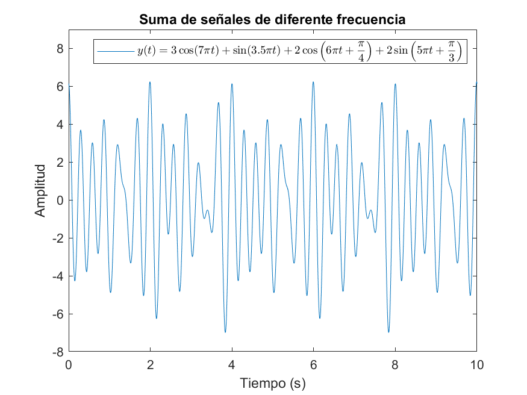
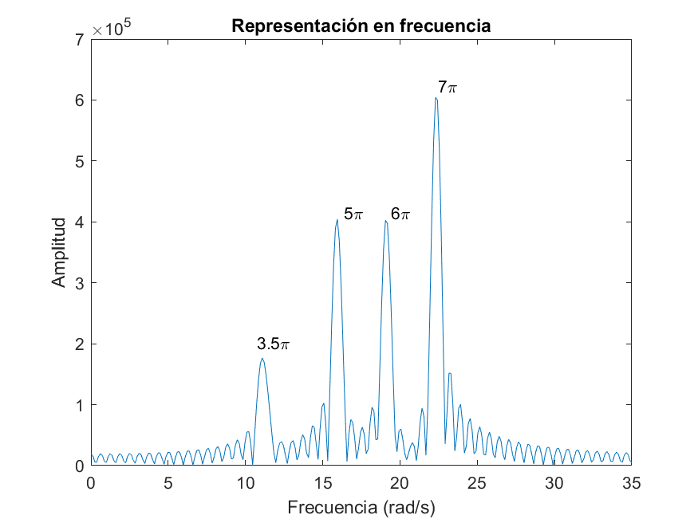
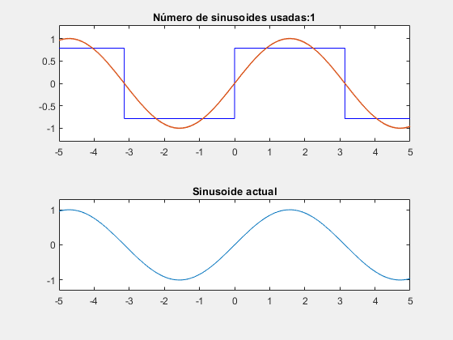

# Transformada de Fourier

## Índice

- [Introducción](#introducción)
  - [Del mundo temporal al frecuencial](#del-mundo-temporal-al-frecuencial)
  - [Utilidad de utilizar el dominio frecuencial](#utilidad-de-utilizar-el-dominio-frecuencial)
- [Fundamentos matemáticos](#fundamentos-matemáticos)
  - [Series de Fourier](#series-de-fourier)
  - [Transformadas de Laplace y Fourier](#transformadas-de-laplace-y-fourier)
  - [DFT - Discrete Fourier Transform](#dft---discrete-fourier-transform)
  - [FFT - Fast Fourier Transform](#fft---fast-fourier-transform)

## Introducción

### Del mundo temporal al frecuencial

En numerosas ocasiones, los ingenieros nos debemos enfrentar a ciertos fenómenos que varían con el tiempo.

Un ejemplo de ello es una onda de sonido, véase un tono puro. Si simplificamos un poco, este fenómeno puede ser descrito de forma matemática, y seguro que ya lo has visto más de una vez:

Exacto, es una función senoidal. Si representamos este tono puro en función de la frecuencia, obtenemos lo siguiente:

La frecuencia se denota como f (si se mide en Hz) o como ω (en rad/s). Esta nos aporta bastante información sobre el sonido. Por ejemplo, una frecuencia de 440 Hz es la que emite un diapasón, y se corresponde con la nota "La". Los humanos escuchamos frecuencias comprendidas entre 20 y 20 000 Hz (aproximadamente).

Esto es lo que se vería si transformásemos el audio de "¡Tira de la palanca, Kronk!" para verlo en el dominio frecuencial:

### Utilidad de utilizar el dominio frecuencial

La historia de la ingeniería sería muy diferente si no hubiéramos aprendido a interpretar y manipular las frecuencias.

A pesar de que Fourier desarrolló las Series de Fourier mientras intentaba resolver la [ecuación del calor](https://es.wikipedia.org/wiki/Ecuaci%C3%B3n_del_calor) (un problema matemático importante por aquella época), el análisis frecuencial llegaría a muchos otros ámbitos de nuestras vidas.

Cuando Cooley y Tukey desarrollaron la FFT en los años sesenta (Transformada de Fourier optimizada para el cálculo computacional), la motivación principal era la detección de misiles rusos en el espacio aéreo estadounidense. Sin embargo, ha sido extremadamente útil en espectroscopía, radiología, telecomunicaciones... Tal vez los nombres suenan un poco abstractos, pero algunas aplicaciones reales comprenden el análisis químico de las atmósferas de exoplanetas, el análisis de radiografías, la producción y post-producción audiovisual, la radio, Internet...

Uno de mis profesores en la ETSIST me explicó su utilidad en las radiofrecuencias con un ejemplo bastante comprensible, así que le tomaré prestada su explicación.

Imagínate que te encuentras en una gran sala con muchos monologuistas, pero están todos hablando al mismo tiempo. Te gustaría escuchar lo que está diciendo solo uno de ellos, pero los demás hablan demasiado alto y no te dejan oírle con claridad. La situación que acabo de describir es análoga a la siguiente gráfica:

Si el monólogo perfecto fuera una función sinusoidal y cada monólogo tuviera una frecuencia diferente, este batiburrillo que acabamos de ver es la explicación gráfica de por qué no entendemos nada de lo que dicen los monologuistas.

Ahora bien, si representamos esta situación en el mundo frecuencial observamos algo interesante...

Como cada monologuista opera en una frecuencia diferente, podemos seleccionar la que nosotros deseemos, desechando el resto. El truco está en que podemos revertir el proceso y obtener exclusivamente el monólogo escogido en el dominio del tiempo.

Esto que acabo de explicar es análogo al funcionamiento de la radio. El dial que mueves se usa para seleccionar la frecuencia de la emisora deseada. Por ejemplo, la emisora de Europa FM tiene asignada la frecuencia de 91.0 MHz en la Comunidad de Madrid.

De la misma forma que se puede inspeccionar y manipular el espectro electromagnético, se puede hacer con canciones (frecuencias de audio) para retocar la mezcla realizada en un estudio, o en aplicaciones de edición fotográfica para editar solo ciertos colores del espectro. Y seguramente me deje muchas otras aplicaciones reales en el tintero. Ahora se entiende mejor por qué la FFT supuso una revolución para el mundo, aunque pasara desapercibida para aquellas personas ajenas a la ingeniería.

## Fundamentos matemáticos

### Series de Fourier

El desarrollo en series de Fourier implica que cualquier función periódica puede ser representada como una suma de infinitas funciónes sinusoidales.

Y esto conlleva muchas cosas, así que voy a dejar que lo proceses.

Ahora que has dejado reposar unos segundos esta información, voy a ponerte el ejemplo más típico: una onda cuadrada.

Al obtener la onda cuadrada como una suma de infinitas sinusoides, podemos ver que si las vamos sumando de una en una (en rojo) va cogiendo la forma de una onda cuadrada real (azul).

Sin embargo, esto es así solo cuando sumamos infinitamente. Puedes ver que con estas pocas sinusoides aparecen ligeras deformaciones, como ese rizado que aparece en las zonas cercanas a las discontinuidades. Esto se conoce como **fenómeno de Gibbs** y es importante tenerlo en cuenta a la hora de implementar esto en el mundo real.

### Transformadas de Laplace y Fourier

Como hemos dicho, las series de Fourier se pueden calcular exclusivamente para señales periódicas. Sin embargo, ¿cómo podríamos analizar en frecuencia señales que no sean periódicas? La respuesta es simple pero curiosa.

Si cogemos esta señal no periódica y la repetimos a propósito, nos quedaría una nueva señal periódica, con periodo T.

Sin embargo, podemos calcular el límite de esta señal cuando el periodo T tiende a infinito. Una señal con periodo infinito es una señal que nunca se repite.

Pues ya está, así de fácil podemos obtener la Transformada de Fourier de cualquier señal, periódica o no periódica.

### DFT - Discrete Fourier Transform

### FFT - Fast Fourier Transform
