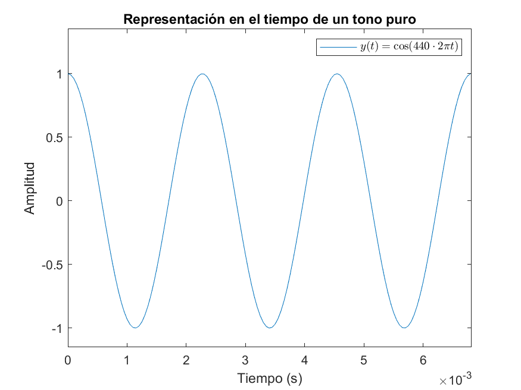
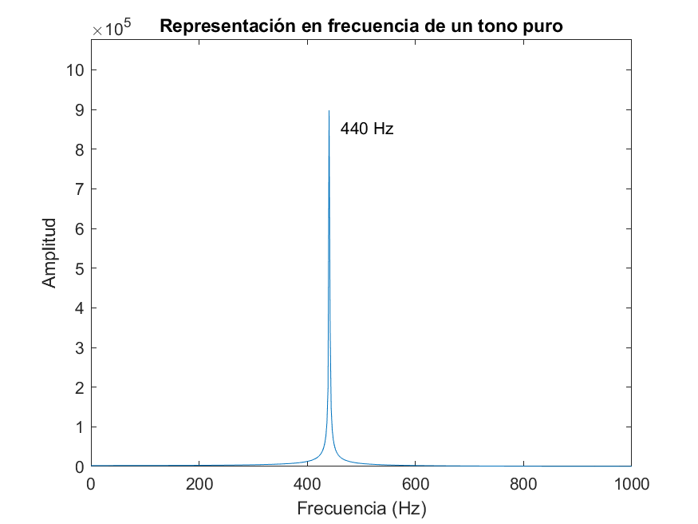

# Transformada de Fourier

## Índice

- [Introducción](#introducción)
  - [Del mundo temporal al frecuencial](#del-mundo-temporal-al-frecuencial)
  - [Utilidad de utilizar el dominio frecuencial](#utilidad-de-utilizar-el-dominio-frecuencial)

## Introducción

### Del mundo temporal al frecuencial

En numerosas ocasiones, los ingenieros nos debemos enfrentar a ciertos fenómenos que varían con el tiempo.

Un ejemplo de ello es una onda de sonido, véase un tono puro. Si simplificamos un poco, este fenómeno puede ser descrito de forma matemática, y seguro que ya lo has visto más de una vez:

Exacto, es una función senoidal. Si representamos este tono puro en función de la frecuencia, obtenemos lo siguiente:

La frecuencia se denota como f (si se mide en Hz) o como ω (en rad/s). Esta nos aporta bastante información sobre el sonido. Por ejemplo, una frecuencia de 440 Hz es la que emite un diapasón, y se corresponde con la nota "La". Los humanos escuchamos frecuencias comprendidas entre 20 y 20 000 Hz (aproximadamente).

Esto es lo que se vería si transformásemos el audio de "¡Tira de la palanca, Kronk!" para verlo en el dominio frecuencial:

### Utilidad de utilizar el dominio frecuencial

La historia de la ingeniería sería muy diferente si no hubiéramos aprendido a interpretar y manipular las frecuencias.

A pesar de que Fourier desarrolló las Series de Fourier mientras intentaba resolver la [ecuación del calor](https://es.wikipedia.org/wiki/Ecuaci%C3%B3n_del_calor) (un problema matemático importante por aquella época), el análisis frecuencial llegaría a muchos otros ámbitos de nuestras vidas.

Cuando Cooley y Tukey desarrollaron la FFT en los años sesenta, la motivación principal era la detección de misiles rusos en el espacio aéreo estadounidense. Sin embargo, ha sido extremadamente útil en espectroscopía, radiología, telecomunicaciones...

Uno de mis profesores en la ETSIST nos lo hizo entender con un ejemplo bastante interesante.
